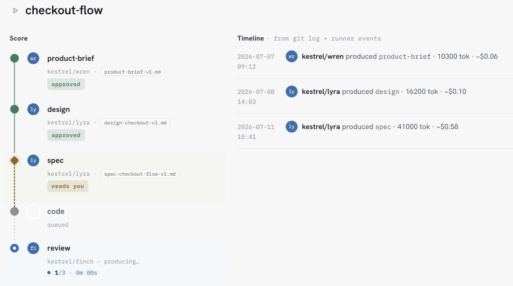

# levare

*(leh-VAH-reh) — the conductor's lift before the downbeat. Nothing runs until you give the beat.*

A solo operator's console for an AI agent workforce. One binary that lets a single person direct
teams of AI agents from pitch to production — and stop them at every step that matters.

Every artifact an agent produces lands as a markdown file with YAML frontmatter in a git repo.
Every step halts at a gate you approve, reject, or send back. The binary holds no state that
can't be reconstructed from the repo.



---

## Why it's built this way

- **Markdown is the truth.** Agents, teams, work units, artifacts — all files in your repo. No
  database, no proprietary format, no state you can't read in an editor or diff in git.
- **Nothing runs unattended.** Every step ends at a gate. You approve, request changes, or reject.
  The runner advances only on your decision.
- **Local-first, one binary.** No server to operate, no cloud account, no telemetry. It reads your
  repo and serves a board on localhost.
- **Deterministic where it counts.** The runner has no model, no judgment, and no clock — it
  recomputes the dependency graph from frontmatter on every walk. The same inputs replay to the
  same result, byte for byte.
- **Agents are sandboxed.** Members that shell out run under OS-level confinement: scoped home,
  per-dispatch working directory, network denied unless a connector grants it.

## Getting started

```sh
curl -fsSL https://raw.githubusercontent.com/go4cas/levare/main/scripts/install.sh | sh
```

```sh
levare init my-studio     # scaffold a studio
cd my-studio
levare serve              # open the board on localhost
```

No API key needed to look around — the board, the registry, and every gate work without one.

Full walkthrough: **[Quickstart](https://go4cas.github.io/levare/02-quickstart)**.

## Documentation

The guide is the place to start: **[go4cas.github.io/levare](https://go4cas.github.io/levare/)**

- [Introduction](https://go4cas.github.io/levare/01-introduction) — what levare is and who it's for
- [Quickstart](https://go4cas.github.io/levare/02-quickstart) — install, scaffold, open the board
- [Concepts](https://go4cas.github.io/levare/03-concepts) — studios, teams, work units, gates
- [Workflow](https://go4cas.github.io/levare/04-workflow/) — from an idea to a shipped unit
- [Reference](https://go4cas.github.io/levare/05-reference/) — every field, command, and rule
- [Operations](https://go4cas.github.io/levare/06-operations) — running the daemon, sandboxing, troubleshooting

## CLI

| Command | What it does |
|---|---|
| `levare init <path>` | Scaffold a new studio |
| `levare serve <path>` | Serve the board on localhost |
| `levare validate <path>` | Validate the whole repo against the contract |
| `levare doctor <path>` | Report what's configured, missing, or unenforceable |
| `levare context <path>` | Show the exact context a member would receive |
| `levare replay <path>` | Replay a studio's story from a clean slate |

## Stack

Bun and TypeScript. Vanilla HTML, CSS, and JavaScript on the front end — no framework, no build
step for the UI. **One runtime dependency** (the Claude Agent SDK), enforced by a check in CI.
Ships as a single compiled binary for macOS and Linux, arm64 and x64.

## Contributing

levare has a [constitution](https://go4cas.github.io/levare/05-reference/04-constitution) — a short
set of invariants a change must not violate (markdown stays the truth, the runner stays
deterministic, the write surface stays small). Read it first; it explains why some obvious-looking
changes are deliberately not made.

Issues and discussion are welcome. If you're proposing a change, say which invariant it touches and
why it holds.

## Status

**v0.2.0** — pre-1.0, built by one person, used daily by its author. The contract, runner, board,
sandbox, and MCP remote members are implemented and tested. Expect sharp edges, and expect the
schema to move before 1.0.

## License

Apache-2.0 — see [LICENSE](LICENSE).