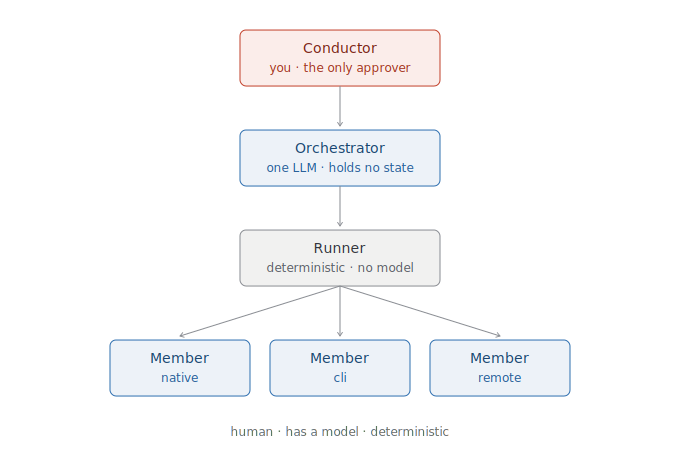

# 1 · Introduction

levare is a console for directing teams of AI agents. You are the conductor: you decide what gets
built, you approve every consequential step, and the agents play on your beat.

It is deliberately **personal software**. There is no multi-tenancy, no accounts, no roles and
permissions, no hosted service. One person, one machine, one git repository. If you want to
collaborate, you use git — the same way you already do.

---

## What it actually is

A single binary that reads a directory of markdown files and serves you a board.

```
levare serve ~/my-studio
→  http://localhost:4173
```

That directory — the **studio** — contains your teams, your agents, the skills and knowledge they
draw on, the projects you're building, and the work in flight. All of it is markdown with YAML
frontmatter, all of it in git. The board is not a database view; it is a **projection of those files,
re-derived on every request.** Delete the binary and you still have everything. Change a file by
hand and the board changes. There is nowhere else for the truth to hide.

---

## The three roles



**You are the Conductor.** You are the only approver. Nothing runs, nothing lands, and nothing
merges without a decision that traces back to you. Your decisions are commits with your name on
them.

**The Orchestrator is one LLM.** It reads the repository, briefs you on what needs your attention,
interprets what you ask for in plain language, and routes it. It holds no state of its own — it
re-derives everything from the files, every time. It never approves anything, and it never starts
work on its own initiative.

**The Runner is deterministic.** No model, no judgment, no surprises. It walks the dependency graph,
invokes members, enforces the guardrails, records what things cost, and **halts at every gate.** The
part of the system that could do damage is the part with no opinions.

**Members are the agents that do the work.** They come in three kinds: `native` (Claude agents,
running through the Agent SDK), `cli` (any foreign command-line agent — Gemini, Codex, whatever you
have installed), and `remote` (an MCP server). To levare they are the same thing: something that
receives a context and returns an artifact.

---

## Why a gate at every step

This is the design decision that everything else follows from, and it wasn't caution — it was
evidence.

levare was built by AI agents in about two days, under exactly the process it now automates. Every
serious bug in that build **passed a green test suite**. A server that printed a URL and served
nothing. A command-injection hole in an argv template. A validator that failed open three separate
ways. A rendered element that existed in the DOM and nowhere on screen. A handle leak that forced
restarts. A daemon that signed its commits with the human's name.

Each one was caught by a person looking at the running system.

The reason is structural, and it's worth stating plainly:

> **Agents and tests fail in the same direction. They verify what they were told to verify.**
> A test is a hypothesis its author had. An agent's test is a hypothesis the agent had about its own
> work. Neither can notice the thing nobody thought to check.

That is not a flaw to be engineered away. It's a property. And the only known compensation is a
human who looks — which is why levare puts you at every consequential step, and why it works very
hard to make what you're looking at *true*.

---

## What levare gives you

- **A board that cannot lie.** Every screen states what it derived itself from. Nothing is cached,
  nothing is a stale projection of a database that drifted.
- **An audit log that distinguishes you from the machine.** Your approvals commit as you. Machine
  work commits as `levare-runner`. `git log` can always answer *who decided this?*
- **Agents from any vendor, on one score.** A Claude agent writes the spec, a Gemini agent researches
  it, a Codex agent reviews it — same contract, same gates, same receipts.
- **Costs you can see.** Every member invocation records what it consumed. Budgets are declared per
  unit, and crossing one raises a gate, not a bill.
- **Credentials that stay where they belong.** A member's process receives exactly the environment
  variables its granted connectors name, and nothing else — not your other keys, not your shell.

## What levare does not give you

Read [Operations](06-operations.md) before you run anything you don't trust. In short: levare governs
which agents run, what they see, what credentials they hold, and what lands in your repository. It
does **not** yet constrain what a wrapped foreign CLI can do to the machine it runs on. That layer is
designed and unbuilt.

---

Next: **[2 · Quickstart](02-quickstart.md)** — a studio on your machine in ten minutes.
