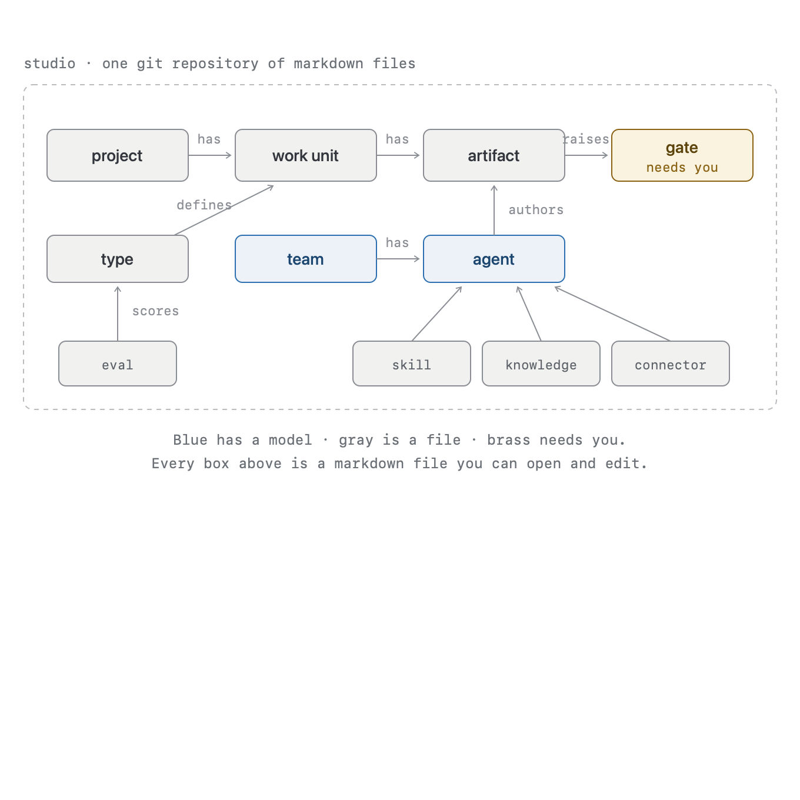
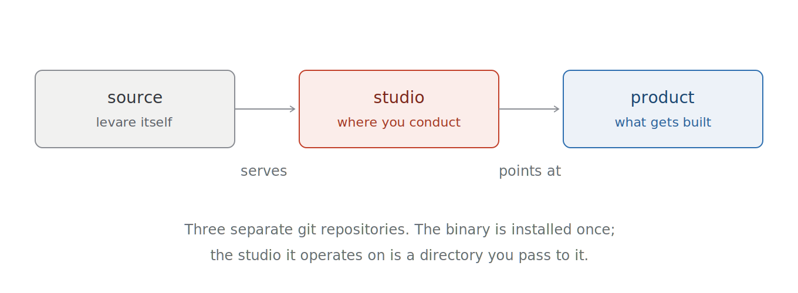
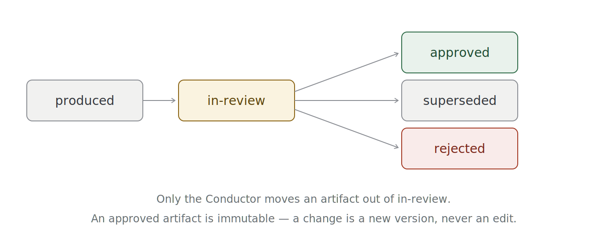
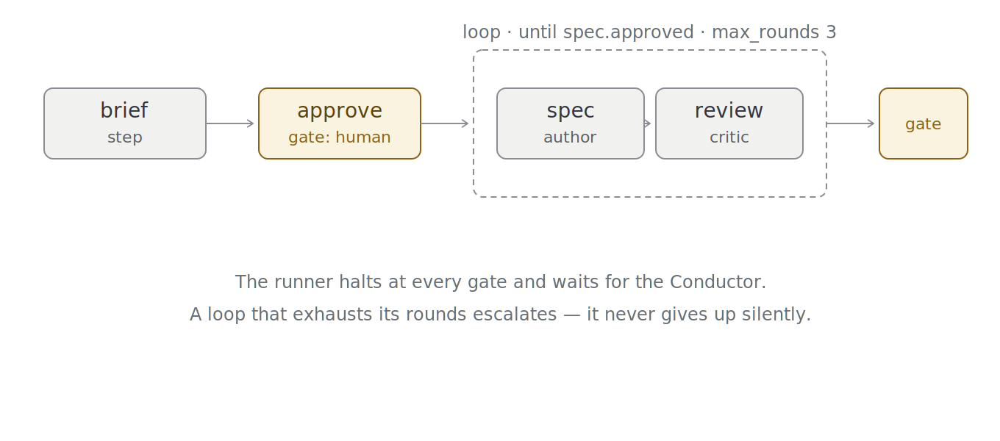
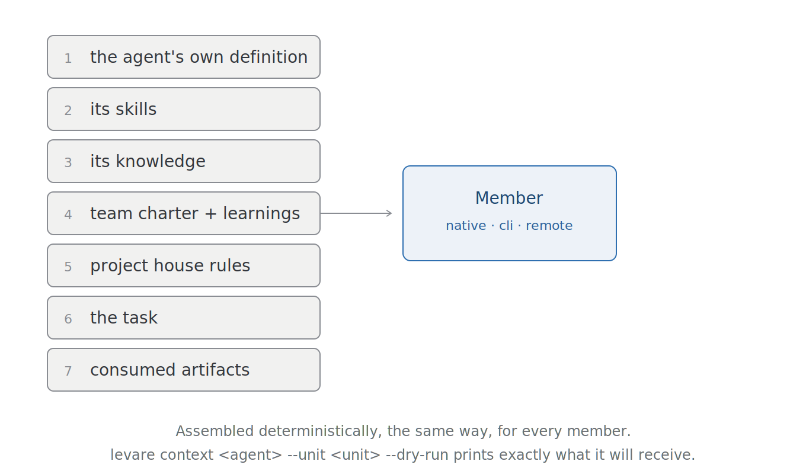

# 3 · Concepts

levare has few concepts, and each one carries weight. This is all of them.

If you'd rather learn by building, skip to **[4 · Workflow](04-workflow/)** and come back when a word
stops making sense.

---

## The whole picture



Read it in two lines:

- **The work:** a *project* has *work units*; a unit produces *artifacts*; an artifact raises a *gate*
  — and a gate is where you come in.
- **The workers:** a *team* has *agents*; an agent *authors* the artifacts. *Types* define what a unit
  is expected to produce. *Skills*, *knowledge*, and *connectors* are what an agent is given.

Every one of those boxes is a markdown file in your studio. Nothing else exists.

---

## Studios, products, and the levare source

Three repositories, three jobs — and confusing them is the most common early mistake.



**The source repo** is levare itself. You clone it, build the binary, and never think about it again.

**Your studio** is a git repository of markdown files: your teams, your agents, your skills, your
work. It is where you conduct. It is *not* inside the levare source — it's yours, and it lives
wherever you keep your work.

**Product repos** are the things your teams actually build. A `project` in your studio is a *pointer*
at one: its git remote, where it deploys, its house rules. levare's work units live in your studio;
the code they produce lands in the product.

```sh
levare serve ~/studio          # the binary, operating on your studio
```

---

## Work units, and the five types

A **work unit** is a piece of work with a beginning and an end. It lives at
`work/<project>/<unit>/`, and everything it produces lives beside it.

There are five types, and the type determines what artifacts the unit is expected to produce and
where it gates:

| Type | Glyph | For | Terminal artifact |
|---|---|---|---|
| `inception` | ◈ | Founding a project — the PRD, the architecture, the design system | the constitution |
| `feature` | ▸ | New capability | shipped code |
| `fix` | ◦ | Something is broken | a fix |
| `spike` | ∗ | A timeboxed question with disposable output | findings |
| `research` | ▤ | Reading and synthesis, no code | a report |

The distinction that matters most: **an inception unit produces the documents every later unit must
cite.** A project's constitution isn't a folder convention — it's the artifacts that later work
`consumes`. Legislation cites the constitution.

---

## Artifacts, and the contract

An **artifact** is a markdown file with YAML frontmatter, produced by a member, that levare knows how
to reason about. The frontmatter *is* the contract:

```yaml
---
kind: spec                              # what type of thing this is
id: spec-checkout-flow-v1               # unique within the project
unit: checkout-flow
project: storefront
status: in-review                       # the lifecycle position
produced_by: lyra                       # which member authored it
consumes: [product-brief-v1, design-checkout-v1]   # its lineage
supersedes: null                        # or the id of the version it replaces
files: []                               # supplementary files travelling with it
created: 2026-07-11
---

The body is the actual document.
```

`consumes` is the important one. It's not metadata — it's the **dependency graph**. levare walks it
to decide what can be produced next, and it's how a spec proves it was written from an approved
brief rather than from thin air.

### The lifecycle



**Only the Conductor moves an artifact out of `in-review`.** Not the Orchestrator, not the daemon,
not the member that wrote it.

And once approved, an artifact is **immutable**. Not by convention — levare records the commit at
which you approved it, and if the file changes afterwards, validation fails. A revision is a *new
version* that `supersedes` the old one. The history stays legible.

---

## Teams, members, and what binds them

A **team** declares what it consumes, what it produces, its members, and its **flow**. An **agent**
is a member: it declares what *kind* of thing it can produce, and how to invoke it.

```yaml
# teams/kestrel.md
name: kestrel
consumes: [pitch]
produces: [product-brief, design, spec]
members: [wren, lyra, finch]
```

```yaml
# agents/lyra.md
name: lyra
kind: native
produces: [design, spec]        # ← this is what binds lyra to a flow step
model: claude-sonnet-5
```

That `produces:` declaration is load-bearing. A team can promise a `spec`, but if no member of it
declares `spec`, the team is a promise with nobody behind it — and `levare validate` will refuse the
studio rather than let it silently do nothing.

### The three kinds of member

- **`native`** — a Claude agent, run through the Agent SDK, in-process. It gets its model, its tool
  allowlist, and its context from its definition.
- **`cli`** — any foreign command-line agent. Gemini, Codex, or a shell script. levare spawns it with
  a structured argv, hands it the assembled context, scopes its environment to exactly its granted
  credentials, times it out, and validates whatever it emits against the contract at the boundary.
- **`remote`** — an MCP server.

To the runner they are the same thing: *something that receives a context and returns an artifact.*
That is the whole reason a multi-vendor studio works.

---

## Flows: steps, gates, and loops

A team's **flow** is a declaration, not code. Three shapes:



```yaml
flow:
  - step: brief             # invoke the member who produces this kind
  - gate: human             # halt. wait for the Conductor.
  - step: design
  - gate: human
  - loop:                   # alternate two members until a condition holds
      between: [spec, review]
      until: spec.approved
      max_rounds: 3
      on_exhaust: gate      # if it never converges, escalate to a human
```

The **loop** is what makes levare more than a task runner: an author and a critic, alternating, with
a declared budget. When a loop exhausts its rounds without converging, it doesn't give up quietly —
it raises a gate and tells you it couldn't get there.

And the **gate** is the constitution:

> **No member process ever starts without a Conductor approval in its causal chain.** Every work
> unit's first step raises a start gate — regardless of type, regardless of dependencies. **A unit's
> existence is not consent.**

---

## Context: what a member actually sees

Every member — native, CLI, or remote — receives the same seven-part context, assembled
deterministically:



You can print it before you spend a cent:

```sh
levare context lyra --unit checkout-flow --dry-run
```

That output is not an approximation. It is byte-for-byte what the member will receive.

**Skills** are reusable instructions (section 2). **Knowledge** is reference material injected by
name (section 3). Both are just markdown in your studio, and both are how you teach a member
something without retraining anything.

---

## Connectors: credentials, scoped

A **connector** is an external system a member can be granted — GitHub, Linear, a model vendor's CLI.
It declares the *names* of the environment variables it needs. **Never their values.** Secrets live in
your shell (or a gitignored `.env`); the repo names them.

```yaml
# connectors/github.md
name: github
kind: cli
command: gh
env: [GITHUB_TOKEN]
```

Grants are per-team or per-agent, and they union. At spawn time, a member's process receives **exactly**
the baseline (`PATH`, `HOME`) plus the variables its granted connectors name — **and nothing else.**
Not your other keys. Not your shell. A member that wasn't granted `github` cannot see `GITHUB_TOKEN`,
because nothing copied it through.

### Two ways to authenticate

A connector declares *how* its backend authenticates, and the two modes differ in what levare can
actually guarantee:

```yaml
auth: env             # the default — levare injects and scopes the named vars
auth: subscription    # the CLI authenticates itself from its own stored login
```

**`auth: env`** is the model above: levare injects the named variables, and that grant *is* the
enforcement. An `env` connector must name at least one variable — one that names none has nothing to
inject, and `levare validate` rejects it.

**`auth: subscription`** is for a CLI that logs itself in and stores a session on disk — Codex via a
ChatGPT plan, for instance. There's nothing for levare to inject, so `env:` must be empty. And here
levare is honest about a limit: it **cannot** scope a credential a CLI reads from your home directory.
Any member that can spawn that binary can use the login, granted or not. `levare doctor` says so
plainly. The grant is documentation, not enforcement.

Prefer `env` where the vendor offers it. A subscription member's cost is also unpriceable — a flat
plan doesn't bill per token — so its receipts record `usd: null` with the plan named, rather than a
fictional `$0`.

`levare doctor` tells you which connectors are ready, and which mode each one is in.

### What a connector is for

`auth` says *how* a connector's backend authenticates. A separate field, `role`, says *what it's for*:

```yaml
role: model    # grants access to a model — codex, a hosted-model API key, etc.
role: tool     # grants access to a tool/service — github, linear, etc. (the default)
```

This matters because the consequence of a broken connector differs by role: a member depending on a
missing `role: model` connector can't start at all; one depending on a missing `role: tool` connector
starts and fails only when it reaches for the tool. `levare doctor` and the registry card both show
`role` for exactly this reason — so you know which failure mode you're looking at.

**A note on naming, since three fields sound alike:** `kind` answers what a thing is *mechanically* —
how levare invokes, connects, or parses it (an agent's `native | cli | remote`, a connector's
`mcp | cli`). `type` answers which *domain template* a thing follows — currently only a work unit's
`type: feature | fix | ...`. `role` answers what *function* a thing serves — currently only a
connector's `role: model | tool`.

### Effects and gates: side-effecting connectors are proposals

A third field, `effects`, says whether a grant lets a member merely *read* through a connector or
*write* through it — post an issue, comment, merge a branch, anything that reaches out and changes
something:

```yaml
effects: read     # the default — a grant IS the credential, exactly as above
effects: write    # a grant is only the right to PROPOSE — see below
gate: proposal    # the default for a write connector — env withheld, see below
gate: trusted     # the declared, visible opt-out — injects exactly like effects: read
```

For an `effects: write` connector, the connector's own author also declares its **action vocabulary**
— the only argv a member can ever cause to run:

```yaml
actions:
  create-issue: ["gh", "issue", "create", "--title", "{title}", "--body-file", "{body_file}"]
```

**The member drafts, the Conductor approves, levare acts.** A member granted a `gate: proposal`
connector never holds its credential — `env.ts`'s allowlist withholds that connector's variables from
the member's process entirely, the same way an ungranted connector's variables were always withheld.
The grant now means "you may draft a proposal against this", not "you hold this". To act, the member
produces an artifact of kind `proposal` naming the connector, one of its declared actions, and `params`
covering every `{placeholder}` in that action's template — never raw argv; it can only ever ask for
something the connector's author already declared possible. That proposal flows to a gate like any
other artifact. When you approve it, levare itself — never the member — substitutes the params into the
template and spawns it, with an environment containing *only* that one connector's variables. The
outcome (exit code, a digest of the output — never the raw bytes, which could echo a secret) is
recorded on the artifact in the same commit as your approval. A failed run never un-approves the
proposal; it blocks the unit with the failure named, so you decide what happens next.

`gate: trusted` is the honest opt-out for a connector you've decided a member should hold directly —
it injects exactly like an `effects: read` connector always has, no proposal required. Use it
deliberately, the same way you'd choose `auth: subscription` over `auth: env`: it's a real capability,
not a default to reach for.

An `effects: write` connector's `kind: mcp` proposal validates and gates identically — but approving it
records `executed: skipped` with a warning, honestly, rather than pretending a call was made. levare has
no live MCP execution path yet (the same documented gap as `kind: remote` members).

---

## Gates, and the verbs

A **gate** is a decision only you can make. On the board it's a card with the artifact, its origin,
its age, its cost, and the verbs available:

- **approve** — the artifact is accepted. The walk resumes.
- **request changes** — with a note. The artifact is superseded by a new version, and the loop goes
  round again.
- **reject** — the artifact is refused and the unit pauses.
- **start / not yet** — on a start gate, for work that hasn't begun.
- **continue / raise / stop** — on a budget gate, when a unit crosses its declared spend.

Every gate resolution is a commit **with your name on it**. Which brings us to the last idea, and
it's the one levare is really about.

---

## The audit log: who decided, and who acted

```
levare-runner — start loyalty-flow → kestrel/wren produced product-brief
cas           — approve spec-checkout-flow-v1
cas           — seed
```

Two identities. **Your decisions commit as you. Machine work commits as `levare-runner`.** They are
never confused, and they cannot be — laundering machine action into human authorship would defeat the
one artifact whose entire purpose is to tell them apart.

Ask `git log` who approved that spec, and it will tell you. Ask it who wrote the code, and it will
tell you that too, and they will be different answers.

---

## The daemon

Turn it on and the score advances by itself: when you approve a gate, the next step *runs* — no
click, no command. It watches `work/`, walks the graph, invokes members, and **halts at every gate.**

It never resolves a gate. It never starts a unit you haven't started. It runs while you're not
looking, and it stops the moment it needs you.

---

Next: **[4 · Workflow](04-workflow/)** — build something, one step at a time.
